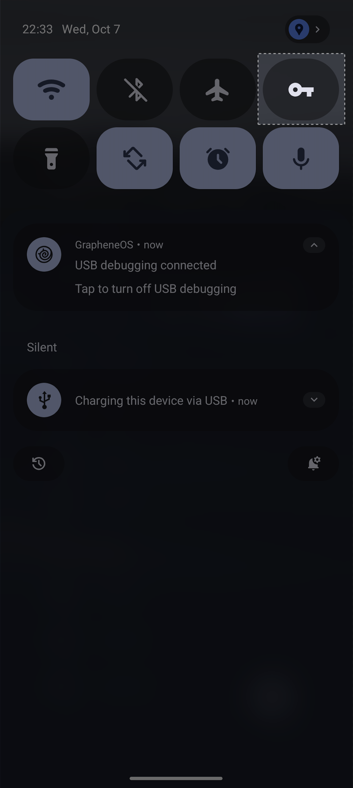

# VPN Tile

Adds a missing Quick Settings tile for VPN status. Tap it to open
Android’s VPN settings; long-press it to open the app.



## Install

<a href="https://apps.obtainium.imranr.dev/redirect?r=obtainium://add/https://github.com/dgmltn/VPNTile"></a>

Or download the latest `VPNTile-<version>.apk` from
[Releases](https://github.com/dgmltn/VPNTile/releases) and open it on your phone.
Requires Android 13 or newer.

Then open the app and tap **Add tile to Quick Settings**.

## What it can’t do

- **Turn VPNs on or off.** Android only lets the VPN app itself do that; the tile opens VPN
  settings instead.
- **Name the VPN app.** Android doesn’t tell other apps who owns the VPN.
- **See a per-app VPN that excludes this app.** The tile reports the VPN that applies to its
  own traffic.

## Building

Needs JDK 21 (Gradle downloads one if it’s missing).

```bash
./gradlew assembleDebug        # debug APK
./gradlew testDebugUnitTest    # unit and Robolectric tests
```

## License

Apache 2.0. See [LICENSE](LICENSE).
